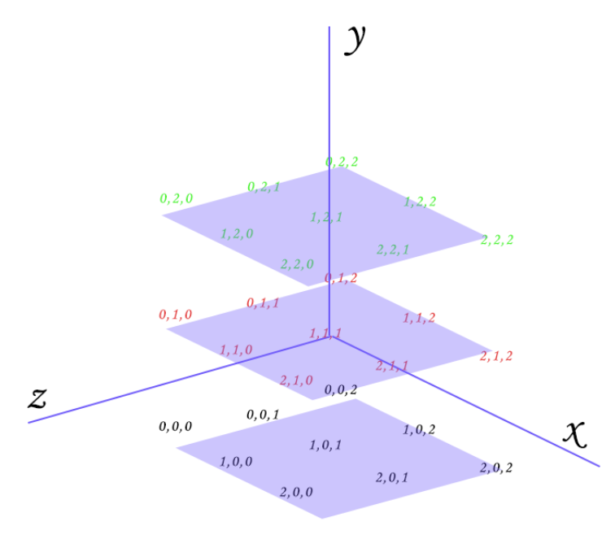

魔方的块的序号从模型空间的第三卦限开始编号，具体如下

| Y=2  | x=0  | x=1  | x=2  |
| ---- | ---- | ---- | ---- |
| Z=2  | 25   | 26   | 27   |
| Z=1  | 16   | 17   | 18   |
| Z=0  | 7    | 8    | 9    |

| Y=1  | x=0  | x=1  | x=2  |
| ---- | ---- | ---- | ---- |
| Z=2  | 22   | 23   | 24   |
| Z=1  | 13   | 14   | 15   |
| Z=0  | 4    | 5    | 6    |

| Y=0  | x=0  | x=1  | x=2  |
| ---- | ---- | ---- | ---- |
| Z=2  | 19   | 20   | 21   |
| Z=1  | 10   | 11   | 12   |
| Z=0  | 1    | 2    | 3    |

step 用于实现单步旋转（目前支持90°顺逆时针旋转，180°也属于单步旋转但是还没有单独实现），三个轴向按x-y-z顺序编号，每个轴向分三层，顺序如上图坐标编码所示。每个step按序存放在链表中。

step(int axis, int pos, int cw)，第axis轴的第pos层按cw或ccw方向旋转90°。

